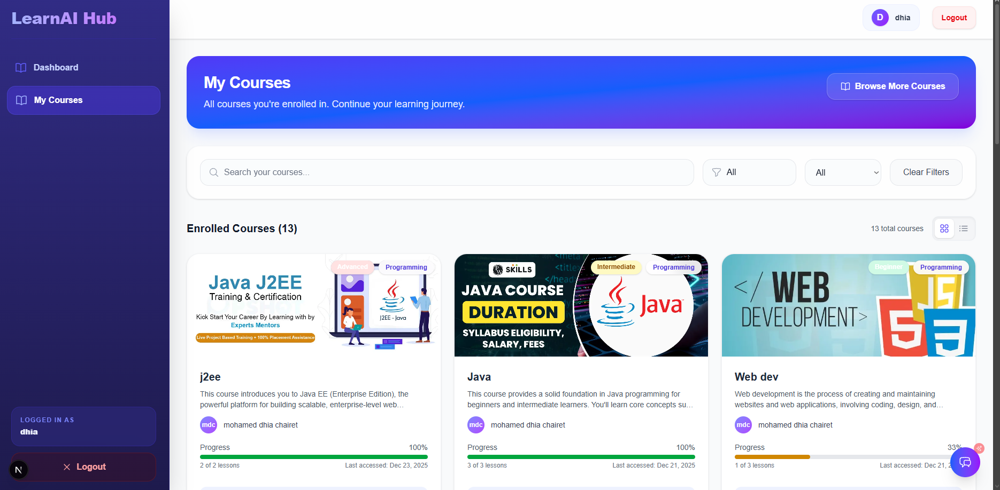

# LearnAI Hub

An e-learning platform with contextual AI assistance for students.

## What It Does

LearnAI Hub lets students enroll in courses, track progress, and get help from an AI assistant that understands exactly which course they're in.

Three user roles:
- **Students**: Browse courses, complete lessons, take quizzes, use AI chat
- **Instructors**: Create courses, upload materials, manage students
- **Admins**: Manage users, approve courses, view analytics

## Screenshots

### Student View
| Student Dashboard | Student Courses |
|:---:|:---:|
|  |  |

### Instructor View
| Instructor Dashboard | Instructor Courses |
|:---:|:---:|
|  |  |

### Admin View
| Admin Dashboard | Course Management |
|:---:|:---:|
|  |  |

| Course Details |
|:---:|
|  |

## Tech Stack

- Next.js 15 (App Router)
- Tailwind CSS
- MongoDB + Mongoose
- JWT Authentication
- Google OAuth
- Gemini API

## Getting Started

### Requirements
- Node.js 18+
- MongoDB database (local or Atlas)

### Installation

```bash
git clone https://github.com/yourusername/learnai-hub.git
cd learnai-hub
npm install