# LearnAI Hub

LearnAI Hub is an e-learning platform with multi-role dashboards and a contextual AI assistant that helps students while they learn.

## Features

**Context-Aware AI Assistant**
The AI chatbot knows which course you're currently taking and what material you're viewing. No need to explain where you are or what you're learning. It uses the Gemini API and maintains conversation history for follow-up questions.

**Role-Based Dashboards**
Three separate experiences tailored for different users:
- Students: Browse courses, track progress, take quizzes, use AI help
- Instructors: Create courses, upload materials, manage enrolled students
- Admins: User management, course approval queues, platform analytics

**Automated Certificates**
Students who complete course materials and pass quizzes receive a generated certificate of completion.

**Course Content Support**
Instructors can upload PDFs, images, and embed YouTube videos. The platform includes an interactive quiz builder and tracks student progress through each course.

## Screenshots

### AI Assistant
| | | |
|:---:|:---:|:---:|
| 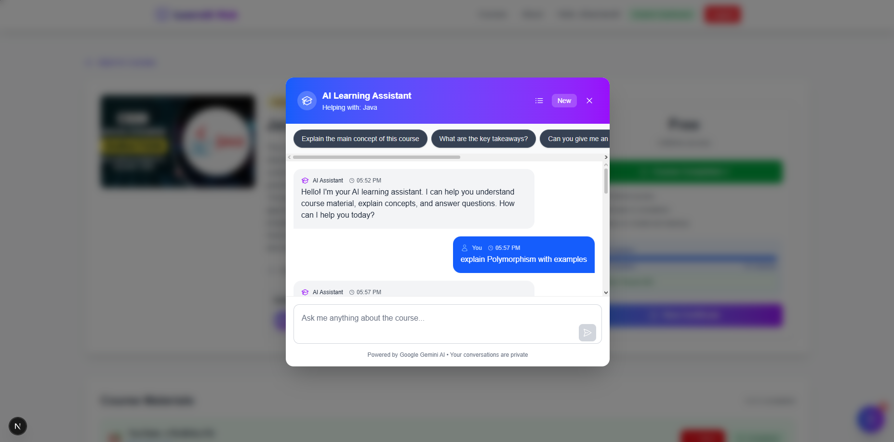 | 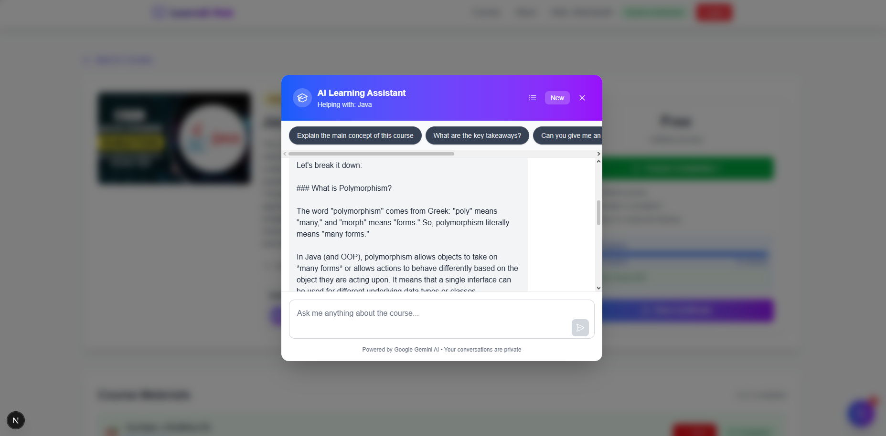 | 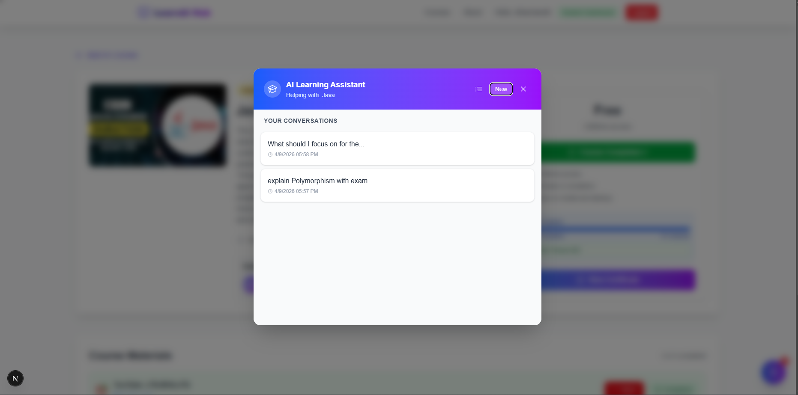 |

### Student Experience
| | |
|:---:|:---:|
| 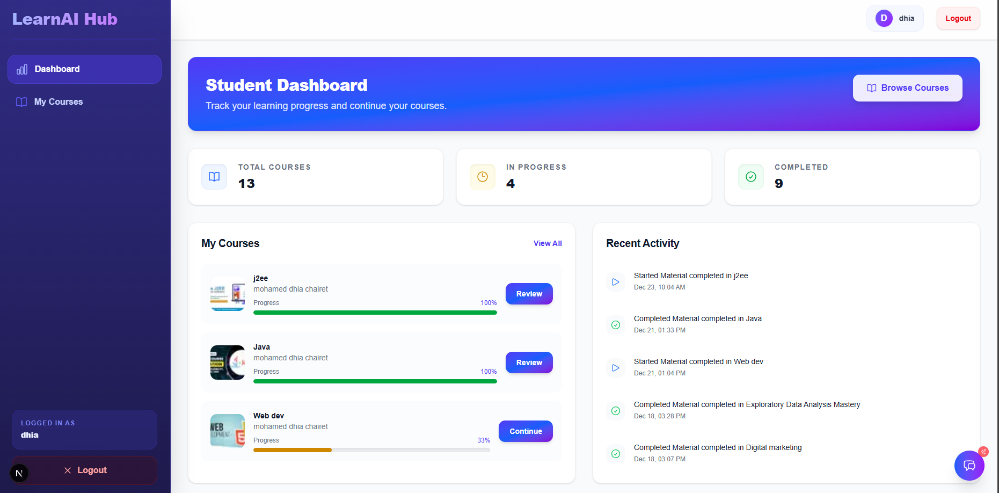 | 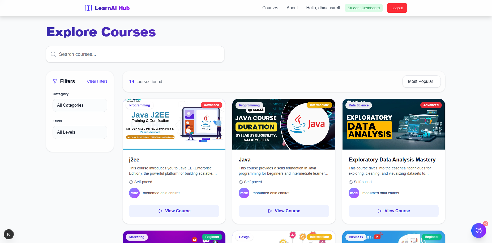 |
| 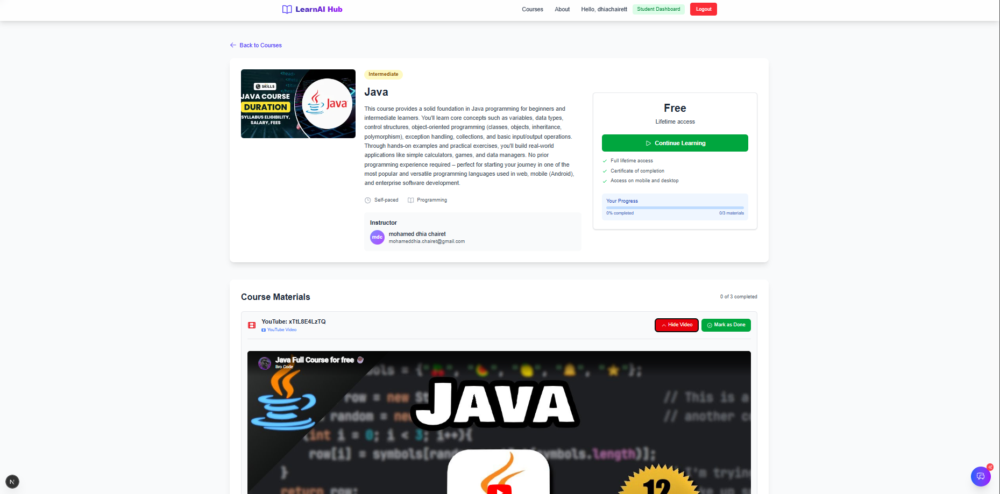 | 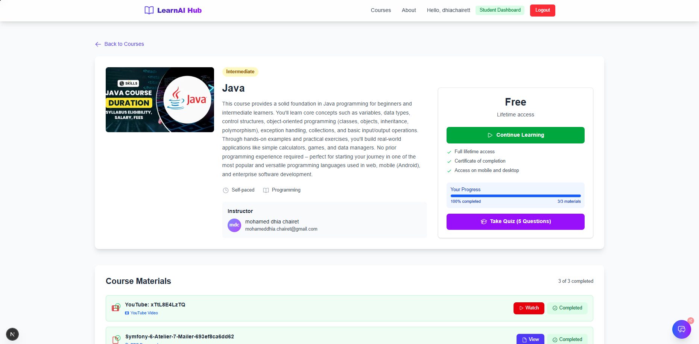 |

### Quizzes and Certificates
| | |
|:---:|:---:|
| 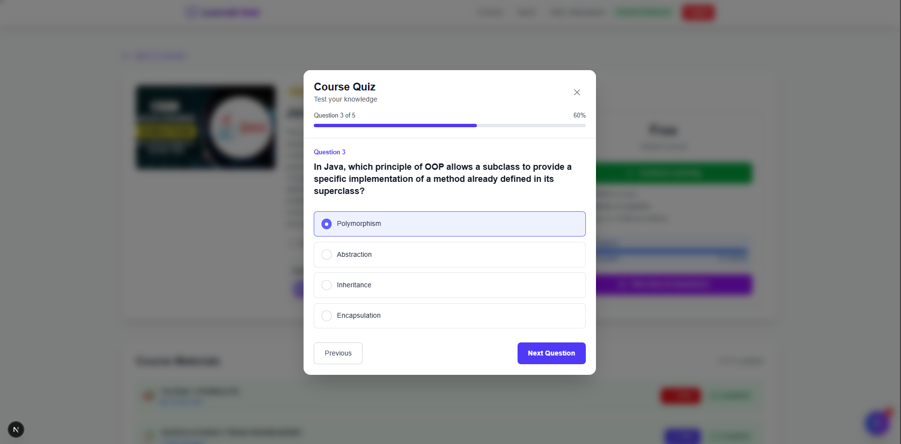 | 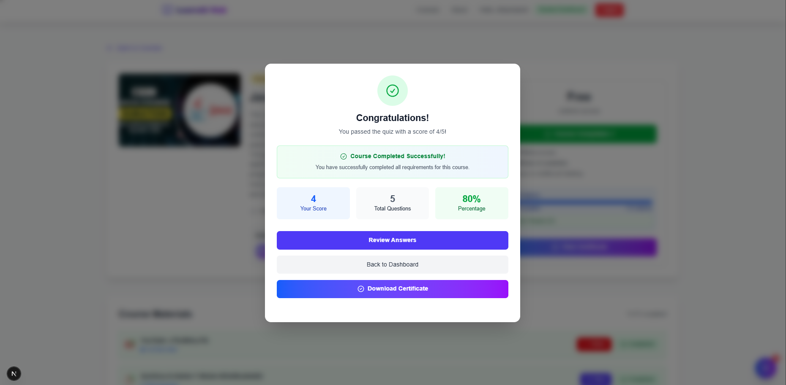 |

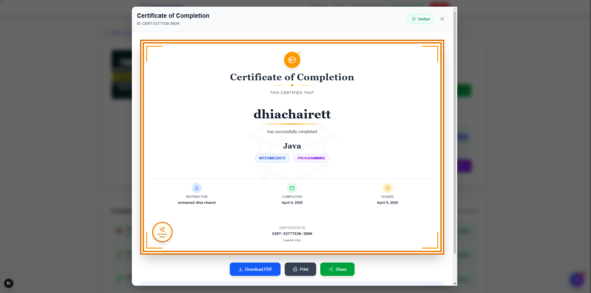

### Instructor View
| | |
|:---:|:---:|
| 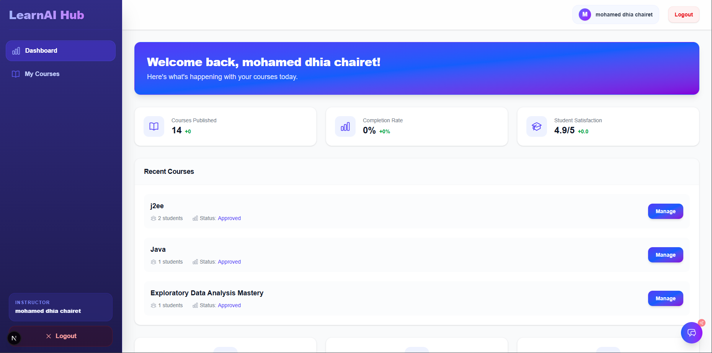 | 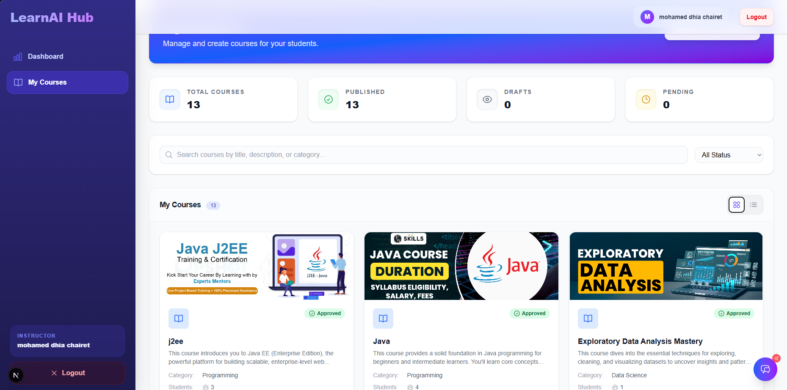 |

### Admin Panel
| | | |
|:---:|:---:|:---:|
| 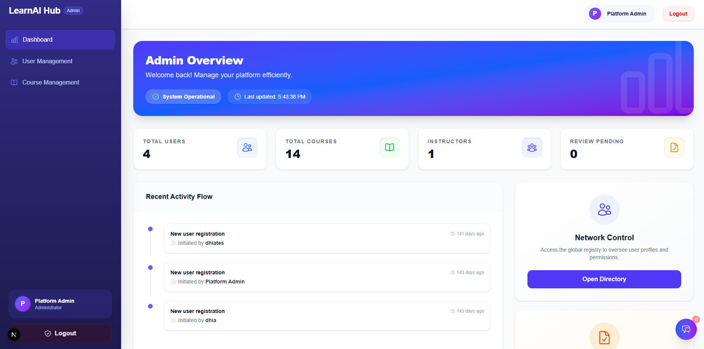 | 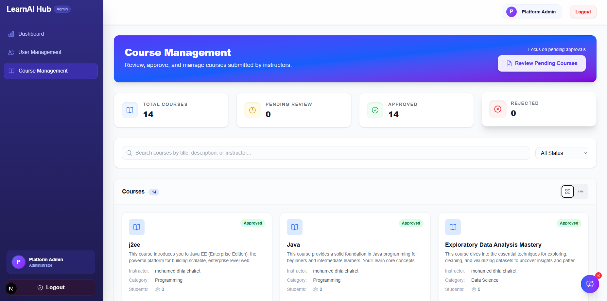 | 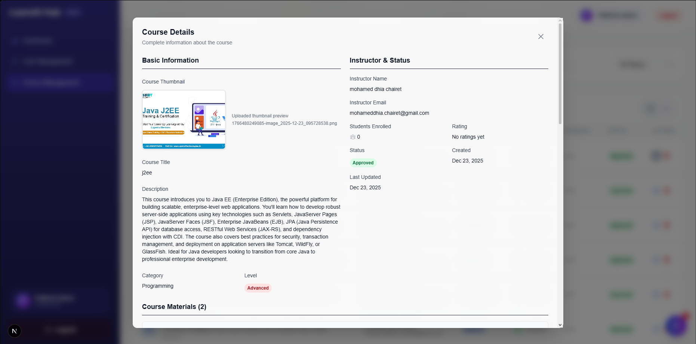 |

## Tech Stack

- Next.js 15 
- Tailwind CSS
- MongoDB with Mongoose
- JWT authentication
- Google OAuth
- Gemini API

## Getting Started

### Requirements
- Node.js 18 or later
- MongoDB database
- Gemini API key

### Installation

```bash
git clone https://github.com/yourusername/learnai-hub.git
cd learnai-hub
npm install
